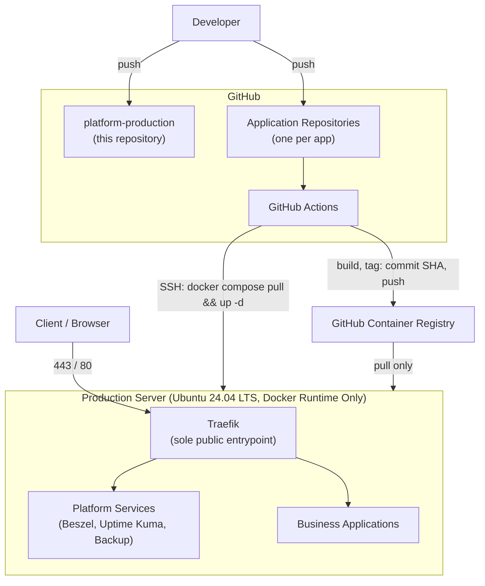

# Platform Production

**Version:** 1.0.0

**Status:** Active

The single source of truth for production infrastructure: a reproducible, secure, automated Docker Compose platform that hosts multiple independently-owned applications on a single Ubuntu server, with Git as the only place infrastructure is ever defined.

---

## Vision

Build a reproducible, secure, automated, and maintainable production platform that can host multiple applications using Docker while keeping infrastructure simple, predictable, and fully documented — recreatable from scratch using only this repository, application repositories, backups, and deployment pipelines.

Full vision and non-goals: [ARCH-001 — Platform Vision](docs/01-architecture/ARCH-001-platform-vision.md).

---

## Goals

- Provide a consistent production runtime for every application.
- Standardize deployment so onboarding a new application is mechanical, not bespoke.
- Eliminate manual deployment and eliminate application source code from production servers.
- Make disaster recovery predictable and rehearsed, not improvised.
- Keep documentation as the single source of architectural truth — implementation follows documentation, never the other way around.

---

## Architecture



This is the platform's system context: developers push to Git, GitHub Actions builds and pushes immutable, commit-SHA-tagged images to GHCR, and the production server only ever pulls and runs — it never builds, never clones source, and is reachable only through Traefik. Full architecture: [ARCH-002 — Platform Architecture](docs/01-architecture/ARCH-002-platform-architecture.md).

### Absolute Rules

- Production never stores application source code, and never builds applications or clones Git repositories.
- Production only holds `compose.yaml`, `.env`, persistent data, Docker volumes, Docker images, and running containers.
- GitHub is the only source of truth; production only ever receives deployments.
- Every application has its own repository; infrastructure and application code never mix.
- Every image is tagged with its Git commit SHA — `latest` is never used.

See [ARCH-001](docs/01-architecture/ARCH-001-platform-vision.md) and [ADR-0001](docs/02-decisions/ADR-0001-runtime-only.md) through [ADR-0005](docs/02-decisions/ADR-0005-git-commit-sha-tags.md) for the full reasoning behind each rule.

---

## Repository Structure

```
platform-production/
├── docs/                  # Architecture, decisions, standards, operations, roadmap
│   ├── 00-templates/
│   ├── 01-architecture/
│   ├── 02-decisions/
│   ├── 03-standards/
│   ├── 04-operations/
│   └── 05-roadmap/
├── infrastructure/        # Deployable platform-service configuration
│   ├── automation/
│   ├── backup/
│   ├── compose/
│   ├── monitoring/
│   ├── networks/
│   └── traefik/
├── templates/             # Application onboarding scaffolding
│   ├── backend/
│   ├── frontend/
│   ├── telegram-bot/
│   └── worker/
├── .github/workflows/     # This repository's own validation workflows
├── README.md
├── LICENSE
├── CHANGELOG.md
└── VERSION
```

Full rationale and rules for this layout: [ARCH-003 — Directory Structure](docs/01-architecture/ARCH-003-directory-structure.md).

---

## Platform Stack

| Layer | Component |
|---|---|
| Operating System | Ubuntu 24.04 LTS |
| Container Runtime | Docker Engine, containerd, Docker Compose Plugin |
| Reverse Proxy / TLS | Traefik |
| CI/CD | GitHub Actions |
| Image Registry | GitHub Container Registry (GHCR) |
| Resource Monitoring | Beszel |
| Uptime Monitoring | Uptime Kuma |
| Logging | Docker `json-file` with rotation |
| Backup | Scheduled, encrypted, offsite |

Explicitly **not** part of the stack: Kubernetes, Docker Swarm, Portainer. See [ADR-0001 — Runtime Only](docs/02-decisions/ADR-0001-runtime-only.md) for why.

---

## Quick Start

**Provisioning a new production server:**

```
git clone https://github.com/<org>/platform-production.git
cd platform-production
sudo ./infrastructure/automation/bootstrap.sh <path-to-deploy-public-key>
./infrastructure/networks/create-networks.sh
cd infrastructure/traefik && cp .env.example .env && docker compose up -d
cd ../monitoring && cp .env.example .env && docker compose up -d
```

Then continue with the full procedure: [OPS-001 — Server Provisioning](docs/04-operations/OPS-001-server-provisioning.md).

**Onboarding a new application:**

1. Copy the relevant directory from `templates/` (`backend/`, `frontend/`, `telegram-bot/`, or `worker/`) into a new application repository.
2. Follow [OPS-002, Section 3.2 — Onboarding a New Application](docs/04-operations/OPS-002-deploy-application.md#32-onboarding-a-new-application-first-deployment).

**Deploying a change:** merge to the application's deploy branch. GitHub Actions handles the rest — see [ARCH-005 — Deployment Strategy](docs/01-architecture/ARCH-005-deployment-strategy.md).

---

## Documentation Index

The full documentation set lives in [`docs/`](docs/README.md), organized as:

| Category | Contents |
|---|---|
| [01-architecture/](docs/01-architecture/) | What the platform is and why it is shaped this way (`ARCH-001`–`ARCH-010`) |
| [02-decisions/](docs/02-decisions/) | Architecture Decision Records — the specific choices behind the architecture (`ADR-0001`–`ADR-0010`) |
| [03-standards/](docs/03-standards/) | Enforceable, checkable engineering standards (`STD-001`–`STD-010`) |
| [04-operations/](docs/04-operations/) | Step-by-step operational runbooks (`OPS-001`–`OPS-010`) |
| [05-roadmap/](docs/05-roadmap/) | Shipped scope, planned scope, and known gaps |

Start with [ARCH-001 — Platform Vision](docs/01-architecture/ARCH-001-platform-vision.md) and [ARCH-002 — Platform Architecture](docs/01-architecture/ARCH-002-platform-architecture.md) for the complete picture.

---

## Contribution Guide

1. Every infrastructure or documentation change is proposed via pull request — nothing is edited directly on the production server, per [ADR-0002 — Git Source of Truth](docs/02-decisions/ADR-0002-git-source-of-truth.md).
2. A change that introduces a new technology choice or reverses an existing one requires a new ADR in `docs/02-decisions/`, using [adr-template.md](docs/00-templates/adr-template.md), before implementation begins.
3. A change to `infrastructure/` or `templates/` must comply with every applicable standard in `docs/03-standards/`; review against [STD-001](docs/03-standards/STD-001-compose-standard.md), [STD-007](docs/03-standards/STD-007-network-standard.md), and [STD-010](docs/03-standards/STD-010-security-standard.md) at minimum.
4. New documents are created from the templates in [`docs/00-templates/`](docs/00-templates/), not written ad hoc, and follow the ID scheme in [STD-002, Section 3.8](docs/03-standards/STD-002-naming-convention.md#38-documentation-ids).
5. This repository's own `.github/workflows/` validate documentation links and Compose file syntax on every pull request.

---

## Roadmap

- [ROADMAP v1](docs/05-roadmap/ROADMAP-v1.md) — current shipped scope (this version, `1.0.0`).
- [ROADMAP v2](docs/05-roadmap/ROADMAP-v2.md) — planned next-scope candidates and their triggers (staging environment, multi-server scaling, HA Traefik, and more).
- [Technical Debt](docs/05-roadmap/technical-debt.md) — tracked gaps between documentation and implementation.

---

## License

[MIT](LICENSE)
