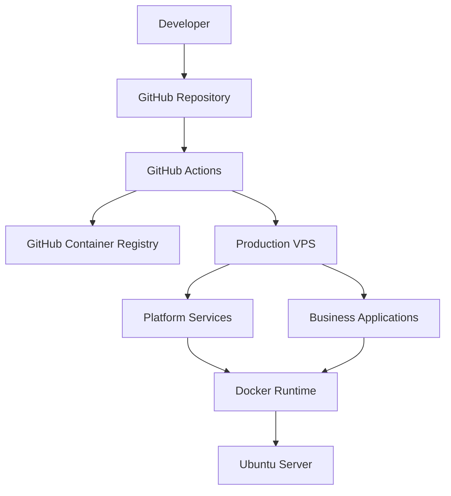
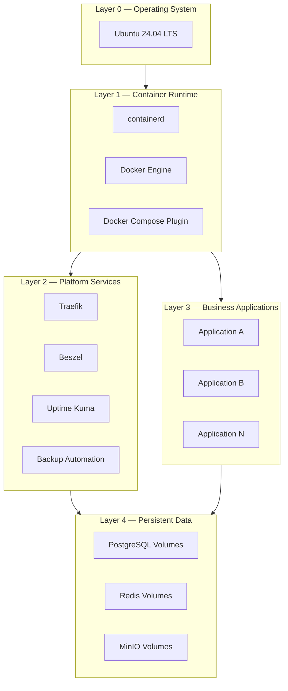
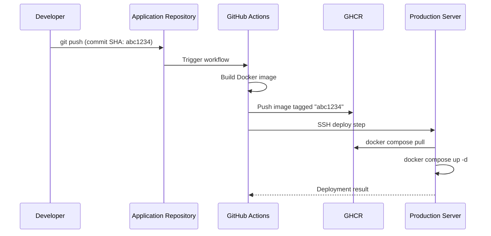
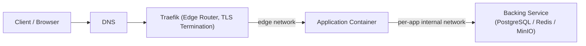
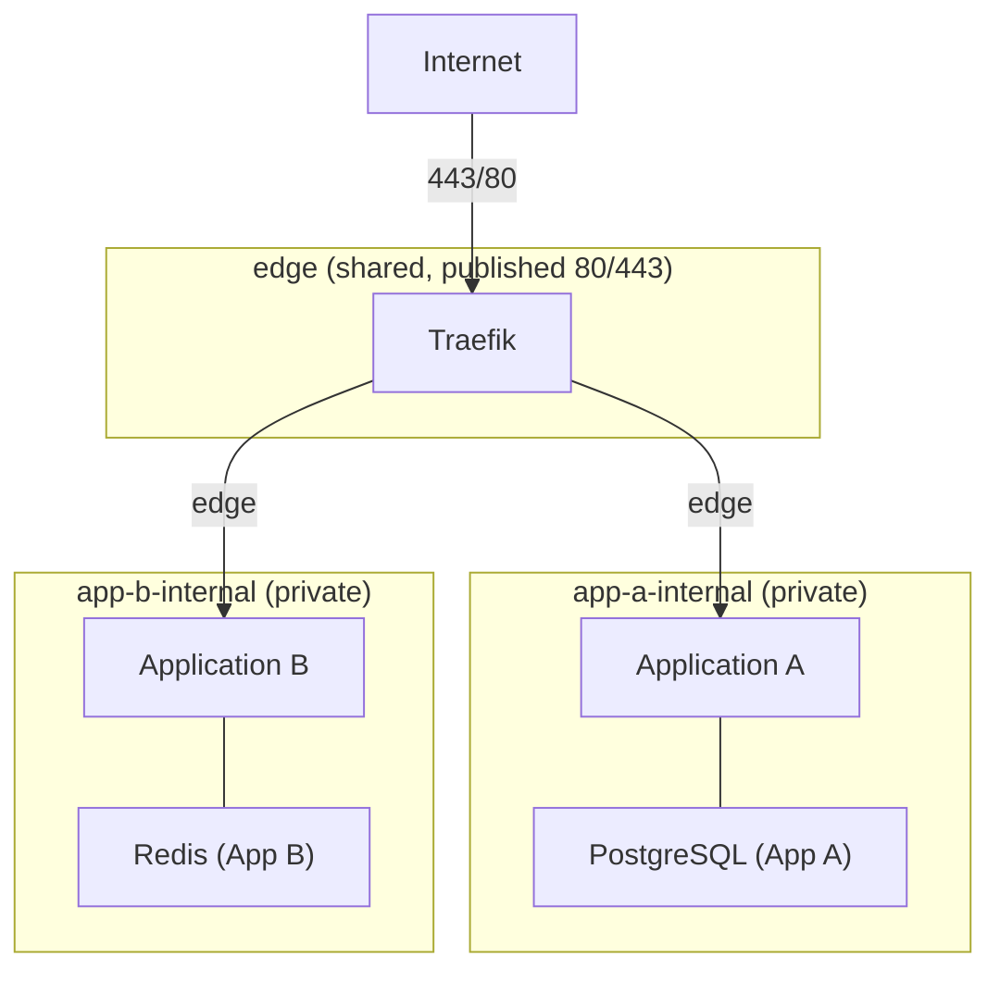
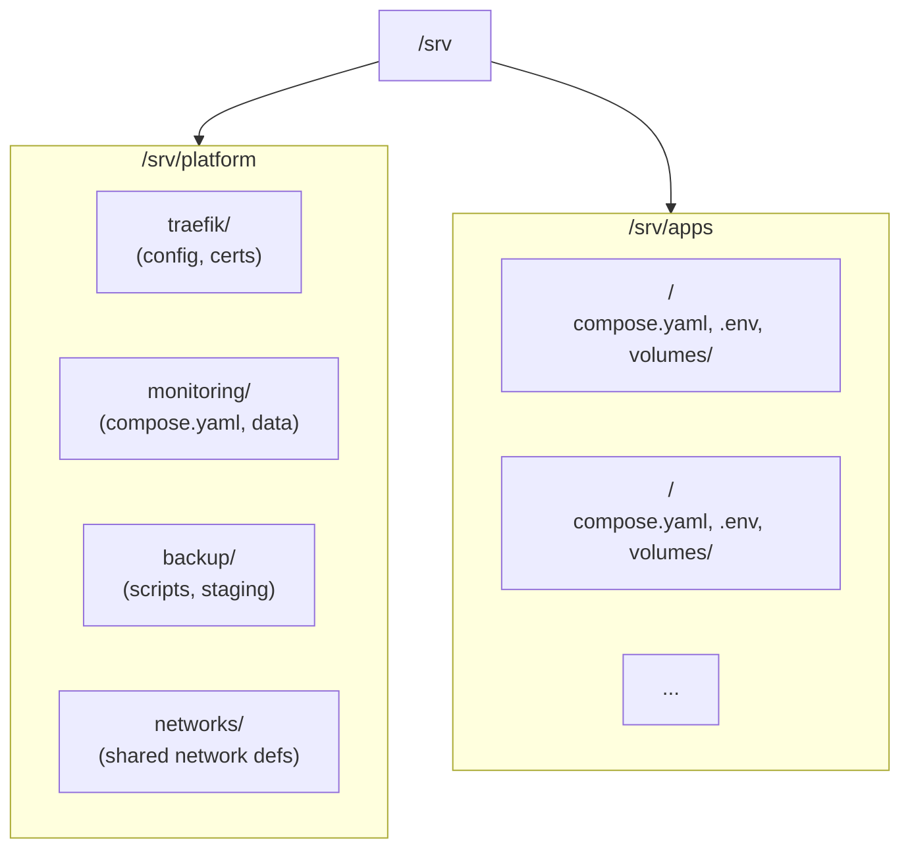

# ARCH-002 — Platform Architecture

**Status:** Approved

**Version:** 1.0

**Owner:** Platform Team

**Last Updated:** 2026-07-15

---

# 1. Purpose

This document defines the overall architecture of the Production Platform.

It describes how infrastructure components, deployment pipelines, runtime services, and business applications interact as a single platform.

The objective of this architecture is to provide a production environment that is:

- reproducible
- secure
- automated
- maintainable
- observable
- scalable

This document serves as the primary architectural reference for every infrastructure decision within the platform.

Implementation details, operational procedures, and coding standards are intentionally documented separately.

---

# 2. Design Principles

The platform is designed around the following engineering principles.

## 2.1 Documentation First

Architecture and standards are documented before implementation.

Infrastructure must follow documentation, not the other way around.

---

## 2.2 Git as the Source of Truth

All infrastructure configuration originates from Git repositories.

Production servers are deployment targets, not configuration sources.

---

## 2.3 Immutable Production

Production servers execute pre-built container images.

Applications are never built directly on production servers.

---

## 2.4 Fully Automated Deployment

Application deployment must be executed through CI/CD pipelines.

Manual deployment is reserved only for emergency recovery procedures.

---

## 2.5 Separation of Responsibilities

Infrastructure, platform services, and business applications are managed independently.

Each layer has clearly defined ownership and responsibilities.

---

## 2.6 Standardization

Every application follows the same deployment, networking, logging, and operational standards.

Consistency is preferred over customization.

---

## 2.7 Security by Default

Every component is deployed using the principle of least privilege.

Only required services are exposed externally.

Secrets are never stored in source repositories.

---

## 2.8 Reproducibility

A production platform must be reproducible from documentation, repositories, backups, and deployment pipelines.

No undocumented manual configuration should exist.

---

## 2.9 Operational Simplicity

Operational procedures should minimize manual intervention.

Routine maintenance should be automated whenever practical.

---

## 2.10 Scalability

The platform architecture must support onboarding additional applications without requiring architectural redesign.

---

# 3. High-Level Architecture

This diagram establishes the boundary referenced throughout this document: **build happens in GitHub Actions**, **storage happens in GHCR**, and **execution happens on the production VPS**. No stage of this flow permits application source code, or an application build step, to run on the production server. Sections 7 and 8 expand this diagram into a deployment sequence and a runtime request flow.

---

# 4. Platform Components

Platform components are divided into two categories: **Platform Services**, which are owned and operated by the Platform Team and support every application, and **Business Applications**, which are independently owned, versioned, and deployed. This section defines only the former; business applications are onboarded using the templates described in Section 6.

## 4.1 Reverse Proxy — Traefik

Traefik is the single public entrypoint for the entire platform. It terminates TLS, performs HTTP(S) routing to the correct application container based on hostname, and is the only component permitted to publish ports `80` and `443` on the host. No application container publishes a host port directly (see Section 9).

## 4.2 Container Runtime — Docker Engine, containerd, Compose Plugin

Docker Engine (with the Compose plugin) and containerd form the execution layer for every workload on the platform, both platform services and business applications. There is no orchestrator beyond Compose; workload placement is a single-host concern by design (see Section 14 for scaling triggers).

## 4.3 Registry — GitHub Container Registry (GHCR)

GHCR is the sole source of deployable artifacts. Every image is built by GitHub Actions and pushed to GHCR under the owning application's repository namespace. Production pulls images; it never pushes or builds them.

## 4.4 CI/CD — GitHub Actions

GitHub Actions is the only system authorized to build images and trigger deployments. Each application repository owns its own workflow, but every workflow conforms to the same contract: build → tag with commit SHA → push to GHCR → deploy via SSH (Section 7).

`platform-production` owns a second, parallel pipeline (`.github/workflows/deploy-platform.yml`) that deploys platform-service configuration under `infrastructure/` to `/srv/platform` the same way — automatically, on push to `main` — but without a build stage, since platform-service images (Traefik, Beszel, Uptime Kuma) are version-pinned public images this repository never builds. See [ADR-0011](../02-decisions/ADR-0011-platform-service-deployment-pipeline.md) and [ARCH-005, Section 11](ARCH-005-deployment-strategy.md#11-platform-service-deployment).

## 4.5 Monitoring — Beszel

Beszel provides host and container-level resource monitoring (CPU, memory, disk, network) across the production server. It is a platform service and is not exposed publicly except through Traefik-authenticated routing.

## 4.6 Uptime Monitoring — Uptime Kuma

Uptime Kuma performs external and internal endpoint health checks for platform services and business applications, and is the source of availability alerting.

## 4.7 Logging — Docker Local Logging with Rotation

All containers use Docker's local (`json-file`) logging driver with size- and file-count-based rotation configured at the Compose level. No centralized log aggregation stack (e.g., ELK) is deployed at the current scale; this is a deliberate, revisitable decision (Section 14).

## 4.8 Backup — Automated Backup Subsystem

Scheduled jobs, defined under `infrastructure/backup/`, capture persistent volumes (database dumps, object storage data, and configuration state) on a recurring schedule and ship them to off-server storage. Backup scope and restore procedure are detailed in Section 13.

## 4.9 Component Summary

| Component | Category | Responsibility |
|---|---|---|
| Traefik | Platform Service | Reverse proxy, TLS termination, sole public entrypoint |
| Docker Engine / containerd | Runtime | Container execution |
| GHCR | Registry | Immutable image storage |
| GitHub Actions | CI/CD | Build, tag, push, deploy |
| Beszel | Monitoring | Resource metrics |
| Uptime Kuma | Monitoring | Endpoint availability |
| Docker logging (json-file + rotation) | Logging | Local log retention |
| Backup automation | Backup | Scheduled data protection |

---

# 5. Runtime Layers

The platform runtime is organized into five layers. Each layer depends only on the layer(s) beneath it, and no layer reaches upward.

- **Layer 0 — Operating System:** Ubuntu 24.04 LTS. Minimal, hardened, provisioned once per server.
- **Layer 1 — Container Runtime:** containerd, Docker Engine, and the Compose plugin. This is the only execution mechanism on the platform.
- **Layer 2 — Platform Services:** Traefik, Beszel, Uptime Kuma, and backup automation. Deployed from `infrastructure/`.
- **Layer 3 — Business Applications:** Independently deployed workloads (Next.js, NestJS, Go, Python, Telegram bots, AI services, static sites, etc.), each sourced from its own repository and deployed via its own pipeline.
- **Layer 4 — Persistent Data:** Named Docker volumes backing stateful services (PostgreSQL, Redis, MinIO), mounted under `/srv/apps` or `/srv/platform` as appropriate (Section 10).

---

# 6. Repository Strategy

The platform draws a hard line between infrastructure and application source code. This line is enforced by repository boundaries, not convention.

| Repository Type | Contains | Never Contains |
|---|---|---|
| `platform-production` (this repository) | Architecture docs, ADRs, standards, `compose.yaml` for platform services, Traefik/monitoring/backup configuration, onboarding templates | Any application source code |
| Application repository (one per app) | Application source code, Dockerfile, its own GitHub Actions workflow, its own `compose.yaml` fragment | Traefik configuration, other applications' code, production secrets |
| `templates/` (within this repository) | Reference skeletons (`backend/`, `frontend/`, `telegram-bot/`, `worker/`) that a new application repository is scaffolded from — CI workflow, Dockerfile, and Compose fragment conventions | Application-specific business logic |

Templates exist to make onboarding a new application mechanical: a new repository copies the relevant template, replaces identifying values (image name, hostname, environment variables), and inherits the platform's build/tag/push/deploy contract without re-deriving it. Template conventions are formalized in `docs/03-standards/` (planned; see Section 16).

---

# 7. Deployment Architecture

Every deployment follows the same non-negotiable sequence, regardless of which application is being deployed:

Key constraints on this flow:

- **The image tag is always the Git commit SHA.** The `latest` tag is never used for deployment. This guarantees that the image running in production is traceable to an exact, immutable commit, and that a rollback is simply "deploy the previous SHA."
- **The production server never runs `docker build`.** Its only responsibilities are `docker compose pull` and `docker compose up -d`, executed over SSH by the workflow's deploy step.
- **The deploy step authenticates using an SSH key**, not a password (Section 11).
- **Each application repository owns its own workflow file**, but every workflow conforms to this same build → tag → push → deploy contract, per the Standardization principle (Section 2.6).

This sequence governs **application** deployment. Platform-service deployment (Traefik, Beszel, Uptime Kuma, backup automation) follows a parallel but simpler sequence — no build or GHCR stage, since those images are pulled directly from public registries — owned by `platform-production`'s own workflows rather than an application repository. See [ARCH-005, Section 11 — Platform Service Deployment](ARCH-005-deployment-strategy.md#11-platform-service-deployment) and [ADR-0011](../02-decisions/ADR-0011-platform-service-deployment-pipeline.md).

---

# 8. Runtime Flow

Once deployed, a request to any application follows a single, standardized path from the internet to the application container:

- The client resolves the application's hostname via DNS to the production server's public IP.
- Traefik is the only process listening on `80`/`443`. It terminates TLS and routes the request to the correct application container based on hostname/router rules defined in that application's Compose labels.
- Traefik reaches the application over the shared `edge` network (Section 9); it never reaches backing services directly.
- The application reaches its own backing services (database, cache, object storage) over a private, per-application internal network that Traefik and other applications cannot access.

---

# 9. Network Architecture

The platform uses Docker's native networking with a strict two-tier model: one shared public edge network, and one private internal network per application.

Rules:

1. **`edge` is the only network that touches the host's published ports**, and Traefik is the only container attached to it that is reachable from the internet.
2. **Every application gets its own private internal network** (e.g., `app-a-internal`) shared only between that application's own containers and its own backing services.
3. **Applications never publish host ports.** An application container is reachable only by joining the `edge` network and being routed to by Traefik. Direct host port publishing is permitted only for infrastructure exceptions that are explicitly documented (e.g., a break-glass admin port), never as a default.
4. **Applications cannot reach each other's networks.** Cross-application communication, if ever required, must go through a defined, documented integration (e.g., an internal API call routed through Traefik), never through shared network membership.
5. Network definitions live under `infrastructure/networks/` and are created before any platform service or application is brought up.

---

# 10. Directory Mapping

Production filesystem layout mirrors the Infrastructure/Applications separation defined in the platform rules. This is the only layout the production server is expected to have.

| Path | Purpose |
|---|---|
| `/srv/platform` | Root for all platform-service runtime state |
| `/srv/platform/traefik` | Traefik static/dynamic configuration, ACME/TLS certificate storage |
| `/srv/platform/monitoring` | Beszel and Uptime Kuma `compose.yaml` and data volumes |
| `/srv/platform/backup` | Backup scripts, schedules, and local staging area before offsite transfer |
| `/srv/platform/networks` | Shared Docker network definitions (`edge`, etc.) |
| `/srv/apps` | Root for all business-application runtime state |
| `/srv/apps/<app-name>/compose.yaml` | Declares the application's containers; image tag is always a Git commit SHA |
| `/srv/apps/<app-name>/.env` | Runtime configuration and secrets for the application; never committed to Git |
| `/srv/apps/<app-name>/volumes` | Persistent data volumes owned by that application |

No path under `/srv/apps` ever contains application source code — only the three artifacts a deployment needs: the Compose file, the environment file, and the volumes. This directly enforces the platform rule that production never stores application source code.

Every path under `/srv` is either produced by [OPS-001 — Server Provisioning](../04-operations/OPS-001-server-provisioning.md) (the `/srv/platform` subtree) or by [OPS-002 — Deploy Application](../04-operations/OPS-002-deploy-application.md) onboarding (each `/srv/apps/<app-name>` subtree). No other location on the production filesystem holds platform or application state.

---

# 11. Security Boundaries

Security controls are enforced at four boundaries:

**Access Control**
- SSH key-based authentication only; password authentication is disabled on the production server.
- The GitHub Actions deploy step uses a dedicated deploy key scoped to the production server, not a personal credential.
- Least privilege applies to every service account and CI credential.

**Secrets**
- No password, token, or credential is ever committed to a Git repository, in either the platform repository or application repositories.
- Runtime secrets exist only in `/srv/apps/<app-name>/.env` on the production server and as encrypted GitHub Actions secrets.

**Network Exposure**
- Only Traefik publishes ports `80`/`443` on the host (Section 9).
- No application or platform service is reachable from the internet except through Traefik.
- Internal networks isolate each application's backing services from every other application.

**Supply Chain**
- Production never runs `docker build`; the only images that can run in production are images built by GitHub Actions and pulled from GHCR.
- Images are addressed exclusively by Git commit SHA, never by a mutable tag such as `latest`, which makes every running container traceable to an exact, reviewable commit.

---

# 12. Operational Boundaries

Ownership is split cleanly between the Platform Team and individual application owners. Neither party operates outside its lane.

| Responsibility | Platform Team | Application Owner |
|---|---|---|
| `platform-production` repository | Owns | No write access required |
| Application repository | No write access required | Owns |
| Traefik, monitoring, backup, networks | Owns and operates | N/A |
| Application Dockerfile and CI workflow | Provides templates (Section 6) | Owns and maintains |
| Production `.env` values | Manages server-side placement and access | Provides required values |
| Triggering a deployment | Maintains the deploy pipeline contract | Triggers by merging to the application's deploy branch |
| Incident response for platform services | Owns | N/A |
| Incident response for application behavior | Supports infrastructure-level diagnosis | Owns |

Detailed runbooks that operationalize this table (on-call procedures, escalation paths, maintenance windows) belong in `docs/04-operations/` and are out of scope for this architectural document (Section 16).

---

# 13. Disaster Recovery Concept

The platform is designed so that a total loss of the production server is recoverable using only: this repository, application repositories, GHCR images, and off-server backups.

**Recovery sequence:**

1. Provision a new Ubuntu 24.04 LTS server.
2. Install Docker Engine, the Compose plugin, and containerd (baseline runtime, Section 5).
3. Clone `platform-production` and recreate `/srv/platform` and shared networks (Section 9, 10).
4. Restore encrypted `.env` files and any platform-service configuration from backup into `/srv/platform` and `/srv/apps/<app-name>`.
5. Restore persistent volumes (database dumps, object storage data) from the latest backup into `/srv/platform` and `/srv/apps/<app-name>/volumes`.
6. Bring up platform services first (Traefik, monitoring, backup) via `docker compose up -d`, or by re-running the `Deploy Platform` workflow (`workflow_dispatch`, all components) once the server's SSH host key and secrets are re-registered, per [OPS-011, Section 3.2](../04-operations/OPS-011-deploy-platform-service.md#32-manual-trigger-redeploy-without-a-new-change).
7. For each application, recreate `/srv/apps/<app-name>` and run `docker compose pull && docker compose up -d` pinned to the last known-good commit SHA.
8. Validate via Uptime Kuma and Beszel that all platform services and applications are healthy.

**Backup scope:**

| Data Class | Example | Backed Up |
|---|---|---|
| Application databases | PostgreSQL volumes | Yes — scheduled dump |
| Object storage | MinIO data | Yes — scheduled sync |
| Cache | Redis | Only if configured for persistence; otherwise treated as rebuildable |
| Configuration | `.env` files, Traefik dynamic config | Yes — encrypted |
| Application source code | N/A | Not applicable — lives in Git, not on the server |
| Container images | GHCR-hosted images | Not backed up separately — GHCR is the durable store |

Because application source code and images are never stored on the server, disaster recovery never depends on the state of the production server itself — only on Git, GHCR, and the backup store.

---

# 14. Future Expansion

The following capabilities are explicitly anticipated but intentionally deferred until justified by real operational need, per the Operational Simplicity principle (Section 2.9):

- **Staging environment** mirroring the production topology, for pre-production validation of the same immutable images that would be promoted to production.
- **Multi-server scaling**, separating the data tier (PostgreSQL, Redis, MinIO) from the application tier onto dedicated hosts, connected via shared overlay networks.
- **Centralized secret management** (e.g., a dedicated secrets manager) to replace per-server `.env` files once the number of applications makes manual `.env` provisioning error-prone.
- **Log aggregation**, if operational scale surpasses what local Docker logging can reasonably support. The current "No ELK" constraint is a scale-appropriate decision, not a permanent one.
- **Orchestration beyond Docker Compose** (e.g., Docker Swarm or Kubernetes) is explicitly out of scope today (see ARCH-001, Non-Goals). This should only be revisited via a dedicated ADR if the platform approaches roughly 50 independently deployed applications or requires multi-node autoscaling — not adopted preemptively.

Each of these, when pursued, must be preceded by an ADR in `docs/02-decisions/` before any implementation begins, per the Documentation First principle (Section 2.1).

---

# 15. Summary

This architecture establishes a Docker Compose–based production platform in which Git is the sole source of truth, GitHub Actions is the sole build system, GHCR is the sole artifact store, and the production server is a pure, immutable deployment target that never builds or clones application code. Infrastructure (`/srv/platform`) and applications (`/srv/apps`) are strictly separated on disk, on the network (Section 9), and in repository ownership (Section 6). Traefik is the platform's only public entrypoint; every other service is reachable only through it. Every deployment is traceable to an exact commit SHA, every routine operation is automated, and every component's responsibility is documented before it is implemented. This document is the authoritative reference that Sections 4 through 14 of every future milestone — compose files, Traefik configuration, monitoring setup, and backup automation — must conform to.

---

# 16. References

- [ARCH-001 — Platform Vision](ARCH-001-platform-vision.md) — defines the platform's goals, non-goals, and core principles that this document implements architecturally.
- `docs/02-decisions/` (planned) — will hold Architecture Decision Records for individual technology choices referenced in this document (e.g., selection of Traefik, Beszel, and Uptime Kuma).
- `docs/03-standards/` (planned) — will define naming conventions, Compose file standards, and environment variable standards referenced in Section 6 and Section 10.
- `docs/04-operations/` (planned) — will define runbooks and operational procedures referenced in Section 12 and Section 13.
