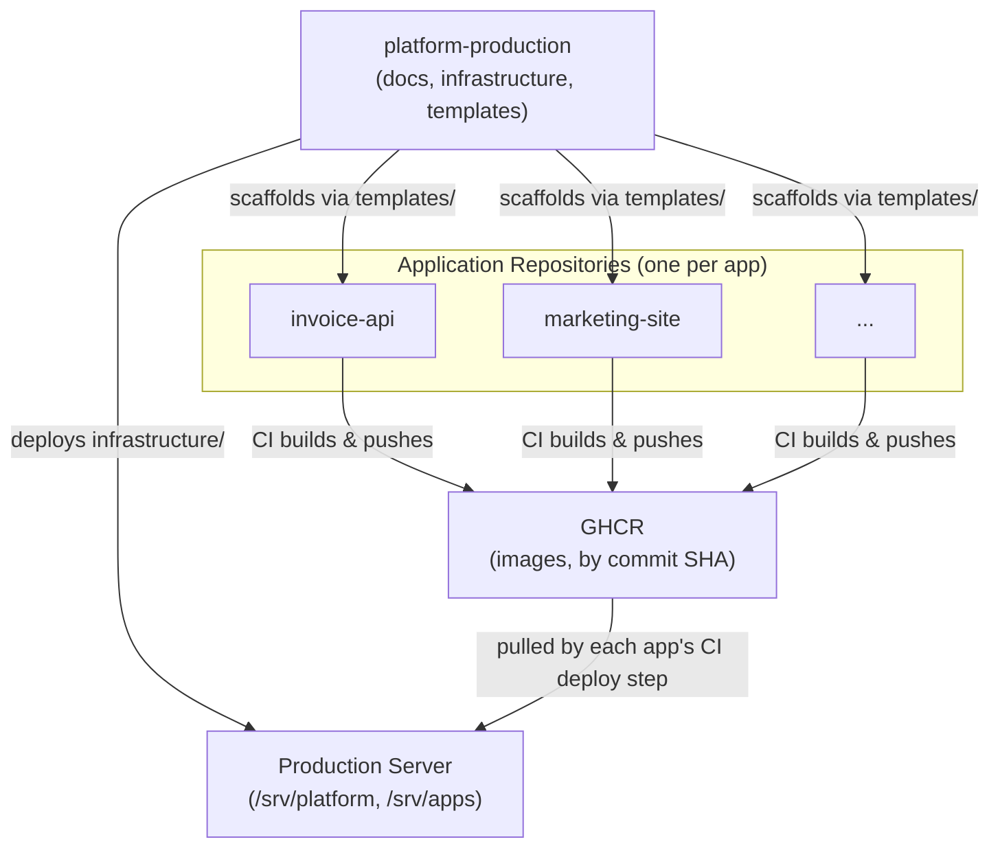

# ARCH-003 — Directory Structure

**Status:** Approved

**Version:** 1.0

**Owner:** Platform Team

**Last Updated:** 2026-07-15

---

# 1. Purpose

This document defines the canonical directory structure of the `platform-production` repository itself, and the structural rules that every application repository must follow. It is the authoritative reference for "where does this file go" questions within the platform's Git repositories.

Production server filesystem layout (`/srv/platform`, `/srv/apps`) is defined separately in [ARCH-002, Section 10 — Directory Mapping](ARCH-002-platform-architecture.md#10-directory-mapping) and is not repeated here.

---

# 2. Scope

This document covers:

- the top-level layout of the `platform-production` repository
- the internal structure of `docs/`
- the internal structure of `infrastructure/`
- the internal structure of `templates/`
- the structural expectations placed on every application repository

This document does not cover file *content* standards (Compose file structure, naming conventions) — those are defined in `docs/03-standards/`.

---

# 3. Platform Repository Structure

```
platform-production/
├── docs/
│   ├── 00-templates/
│   ├── 01-architecture/
│   ├── 02-decisions/
│   ├── 03-standards/
│   ├── 04-operations/
│   └── 05-roadmap/
├── infrastructure/
│   ├── automation/
│   ├── backup/
│   ├── compose/
│   ├── monitoring/
│   ├── networks/
│   └── traefik/
├── templates/
│   ├── backend/
│   ├── frontend/
│   ├── telegram-bot/
│   └── worker/
├── .github/
│   └── workflows/
├── README.md
├── LICENSE
├── CHANGELOG.md
└── VERSION
```

Every top-level directory has exactly one responsibility. No directory may contain files belonging to another directory's responsibility.

| Directory | Responsibility | Must Never Contain |
|---|---|---|
| `docs/` | Architecture, decisions, standards, operations, roadmap | Runnable infrastructure code |
| `infrastructure/` | Deployable Compose files and configuration for platform services | Application source code |
| `templates/` | Reference scaffolding for new application repositories | Business logic, production secrets |
| `.github/` | CI workflows for this repository (documentation/config validation only) | Application build or deploy workflows |

---

# 4. Documentation Structure (`docs/`)

| Directory | Contents | ID Prefix |
|---|---|---|
| `00-templates/` | Canonical templates that every document in `01`–`04` is derived from | — |
| `01-architecture/` | Architecture documents describing system structure and design | `ARCH-XXX` |
| `02-decisions/` | Architecture Decision Records | `ADR-XXXX` |
| `03-standards/` | Enforceable, checkable engineering standards | `STD-XXX` |
| `04-operations/` | Step-by-step operational runbooks | `OPS-XXX` |
| `05-roadmap/` | Forward-looking plans, technical debt, and future features | — |

Documents are numbered sequentially within their category and are never renumbered after being approved. A superseded document is marked `Superseded by <ID>` in its status field rather than deleted or renumbered, preserving historical traceability.

---

# 5. Infrastructure Structure (`infrastructure/`)

| Directory | Contents |
|---|---|
| `automation/` | Deployment and provisioning scripts invoked by GitHub Actions or documented OPS procedures (e.g., server bootstrap script referenced by [OPS-001](../04-operations/OPS-001-server-provisioning.md)) |
| `backup/` | Backup job definitions and schedules, per [ARCH-008](ARCH-008-backup-architecture.md) |
| `compose/` | Root/shared Compose fragments that tie platform services together (e.g., the shared `edge` network declaration consumed by `traefik/` and `monitoring/`) |
| `monitoring/` | `compose.yaml` and configuration for Beszel and Uptime Kuma, per [ARCH-009](ARCH-009-monitoring-architecture.md) |
| `networks/` | Docker network definitions, per [ARCH-004](ARCH-004-network-architecture.md) |
| `traefik/` | Static and dynamic Traefik configuration, per [ARCH-004](ARCH-004-network-architecture.md) |

Every subdirectory under `infrastructure/` is deployable independently via its own `compose.yaml`, and every subdirectory maps to exactly one runtime concern. This mirrors the Single Responsibility principle from [ARCH-001](ARCH-001-platform-vision.md).

---

# 6. Templates Structure (`templates/`)

| Directory | Purpose |
|---|---|
| `backend/` | Scaffolding for API/backend services (Dockerfile, `compose.yaml` fragment, GitHub Actions workflow, README) |
| `frontend/` | Scaffolding for frontend/static applications |
| `telegram-bot/` | Scaffolding for long-running Telegram bot workers |
| `worker/` | Scaffolding for background/queue worker processes |

Each template directory contains, at minimum:

```
templates/<type>/
├── Dockerfile
├── compose.yaml
├── .github/workflows/deploy.yml
└── README.md
```

New application repositories are created by copying the relevant template directory's contents into a new, independent Git repository — never by referencing the template directory at runtime. Templates are copied once at onboarding time; they are not shared dependencies.

---

# 7. Application Repository Structure

Every application repository, regardless of type, must satisfy the following structural rules, enforced by [STD-003 — Repository Standard](../03-standards/STD-003-repository-standard.md):

1. Contains exactly one `Dockerfile` at a location referenced by its `compose.yaml` fragment.
2. Contains exactly one `compose.yaml` fragment describing its own containers only.
3. Contains its own `.github/workflows/deploy.yml`, conforming to [STD-009 — GitHub Actions Standard](../03-standards/STD-009-github-actions-standard.md).
4. Contains a `README.md` derived from [readme-template.md](../00-templates/readme-template.md).
5. Never contains a populated `.env` file (an `.env.example` with placeholder keys is permitted).
6. Never contains Traefik, monitoring, or backup configuration — those belong exclusively to `platform-production`.

---

# 8. Repository Relationships



`platform-production` has no runtime dependency on any application repository, and no application repository has a build-time or runtime dependency on `platform-production` beyond having been scaffolded from one of its templates at creation time. The only thing every repository shares is the production server as a common deployment target, and GHCR as a common artifact store — never a shared code dependency, per [ARCH-002, Section 6 — Repository Strategy](ARCH-002-platform-architecture.md#6-repository-strategy).

---

# 9. Summary

The platform repository's structure is a direct expression of the separation between documentation, deployable infrastructure, and application scaffolding. Every application repository is structurally uniform by construction, because every one of them originates from a `templates/` directory governed by this same document. Any new top-level directory added to `platform-production` must be justified by an ADR before it is created.

---

# 10. References

- [ARCH-001 — Platform Vision](ARCH-001-platform-vision.md)
- [ARCH-002 — Platform Architecture, Section 6 (Repository Strategy) and Section 10 (Directory Mapping)](ARCH-002-platform-architecture.md)
- [STD-003 — Repository Standard](../03-standards/STD-003-repository-standard.md)
- [STD-002 — Naming Convention](../03-standards/STD-002-naming-convention.md)
