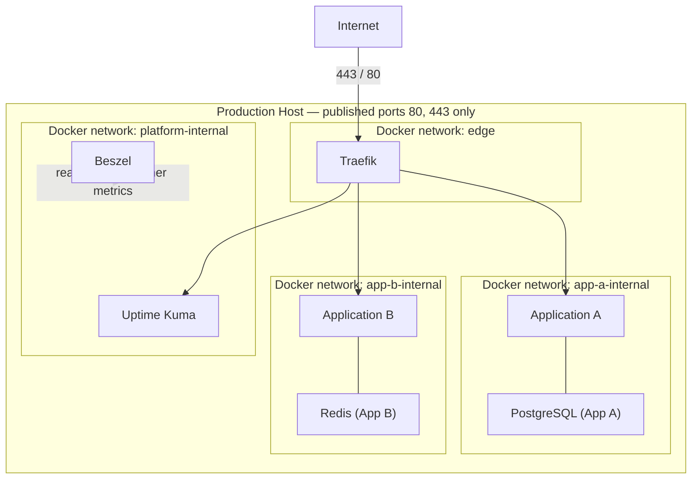

# ARCH-004 — Network Architecture

**Status:** Approved

**Version:** 1.0

**Owner:** Platform Team

**Last Updated:** 2026-07-15

---

# 1. Purpose

This document is the authoritative, detailed specification of the platform's Docker network topology. [ARCH-002, Section 9](ARCH-002-platform-architecture.md#9-network-architecture) introduces the two-tier network model at overview level; this document defines it completely, including DNS, TLS termination, port publishing, and isolation guarantees.

---

# 2. Scope

Covers Docker network topology, DNS resolution, TLS certificate issuance, port exposure rules, and inter-service reachability. Does not cover Traefik routing configuration syntax (covered operationally in `infrastructure/traefik/`) or firewall/host-level hardening (covered in [ARCH-007 — Security Architecture](ARCH-007-security-architecture.md)).

---

# 3. Network Topology

There are exactly three network classes on the platform:

1. **`edge`** — one shared network. Only Traefik and the containers it must route to are attached to it.
2. **`<app-name>-internal`** — one private network per application, shared only between that application's own containers and its own backing services.
3. **`platform-internal`** — one private network for platform services (Beszel, Uptime Kuma) that need to reach each other but not application internals.

---

# 4. Rules

1. **Only Traefik publishes host ports 80 and 443.** No other container, platform service or application, publishes a host port under normal operation. Any exception (e.g., a temporary break-glass admin port) must be explicitly documented in that service's `compose.yaml` with a comment referencing the justifying incident or ADR, and removed once no longer needed.
2. **Every application receives exactly one private internal network**, named `<app-name>-internal`, created before the application's containers start.
3. **Traefik is attached to `edge` and to every application's internal network it must route to.** This is the only sanctioned cross-network attachment. Traefik never joins a network solely to reach a backing service.
4. **Applications never join another application's internal network.** Cross-application communication, when required, is routed through Traefik as an ordinary HTTP request over `edge`, never through shared Docker network membership.
5. **Backing services (PostgreSQL, Redis, MinIO, etc.) are attached only to their owning application's internal network.** They are never attached to `edge` and are never directly reachable from the internet.
6. **Network names are unique per environment** and follow [STD-007 — Network Standard](../03-standards/STD-007-network-standard.md).
7. **Networks are created before any service that depends on them**, via `infrastructure/networks/` definitions applied during [OPS-001 — Server Provisioning](../04-operations/OPS-001-server-provisioning.md).

---

# 5. DNS and TLS

- DNS is managed externally (outside this repository's scope) and points every application hostname at the production server's public IP.
- Traefik obtains and renews TLS certificates automatically via ACME (HTTP-01 or DNS-01 challenge, configured per environment) and terminates TLS for every hostname it routes.
- No application container holds a TLS certificate or terminates TLS itself. TLS termination happens exactly once, at Traefik.
- HTTP requests on port 80 are redirected to HTTPS on port 443 by a platform-wide Traefik rule; no application configures its own redirect.

---

# 6. Isolation Guarantees

| From | To | Allowed |
|---|---|---|
| Internet | Traefik (`edge`, 80/443) | Yes |
| Internet | Any application container directly | No |
| Internet | Any backing service directly | No |
| Traefik | Application container (`edge`) | Yes |
| Traefik | Backing service | No |
| Application A | Application B | No (must route through Traefik/HTTP if ever required) |
| Application A | Application A's own backing service | Yes (via `app-a-internal`) |
| Application A | Application B's backing service | No |
| Beszel / Uptime Kuma | Application internal network | No — metrics are collected via the Docker socket/API, not by joining application networks |

This table is the enforcement contract: any Compose file that would violate a "No" row fails review under [STD-001 — Compose Standard](../03-standards/STD-001-compose-standard.md).

---

# 7. Failure Modes

- **Traefik container down:** entire platform becomes unreachable from the internet (single entrypoint by design, Section 4.1 of [ARCH-002](ARCH-002-platform-architecture.md)). Mitigated by Traefik's own restart policy and Uptime Kuma alerting ([ARCH-009](ARCH-009-monitoring-architecture.md)); multi-instance Traefik is deferred (see [ROADMAP v2](../05-roadmap/ROADMAP-v2.md)).
- **Application internal network misconfiguration:** fails closed — a backing service unreachable from its own application surfaces immediately as an application error, not a silent cross-application leak, because networks are never shared by default.
- **DNS misconfiguration:** does not affect already-established routing; only affects new client connections resolving to the wrong host.

---

# 8. Summary

The platform's network architecture guarantees that the internet can reach exactly one process (Traefik), every application is network-isolated from every other application by default, and no backing service is ever directly reachable from outside its own application. This is enforced structurally through Docker network membership, not through application-level access control.

---

# 9. References

- [ARCH-002 — Platform Architecture, Section 9](ARCH-002-platform-architecture.md#9-network-architecture)
- [ARCH-007 — Security Architecture](ARCH-007-security-architecture.md)
- [ADR-0006 — Traefik](../02-decisions/ADR-0006-traefik.md)
- [STD-007 — Network Standard](../03-standards/STD-007-network-standard.md)
