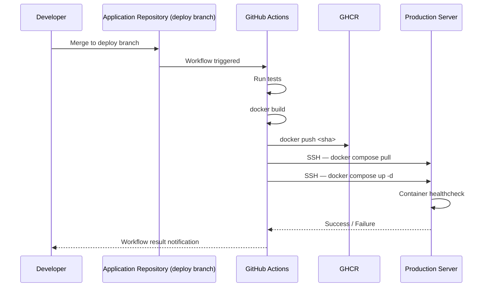
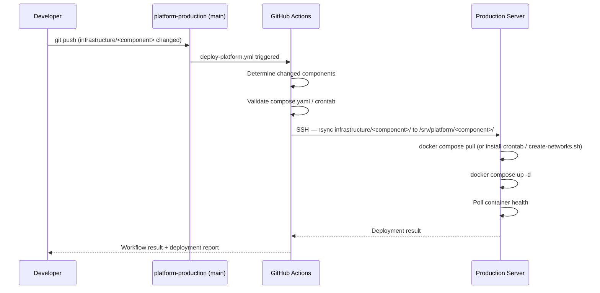

# ARCH-005 — Deployment Strategy

**Status:** Approved

**Version:** 1.0

**Owner:** Platform Team

**Last Updated:** 2026-07-15

---

# 1. Purpose

This document defines how code moves from a developer's commit to a running container in production. [ARCH-002, Section 7](ARCH-002-platform-architecture.md#7-deployment-architecture) introduces the deployment sequence at overview level; this document defines the full strategy, including triggers, environments, concurrency, and health verification.

---

# 2. Scope

Covers deployment triggers, branching model, image tagging, deployment concurrency, and post-deploy health verification. Sections 3 through 10 cover **application** deployment specifically; Section 11 covers **platform service** deployment (Traefik, monitoring, backup, networks), which shares this document's principles but not its build/tag/GHCR mechanics. Does not cover the mechanics of rollback (see [OPS-003 — Rollback](../04-operations/OPS-003-rollback.md)) or the CI workflow file syntax (see [STD-009 — GitHub Actions Standard](../03-standards/STD-009-github-actions-standard.md) for applications, [STD-011 — Platform Deployment Pipeline Standard](../03-standards/STD-011-platform-deployment-pipeline-standard.md) for platform services).

---

# 3. Environments

The platform currently operates a single environment: **production**. There is no staging environment in v1.

| Environment | Exists Today | Notes |
|---|---|---|
| Production | Yes | The only environment defined in this document |
| Staging | No | Deferred; see [ROADMAP v2](../05-roadmap/ROADMAP-v2.md) |
| Local development | Out of scope | Owned by each application repository, not the platform |

Because there is no staging environment, every application's CI pipeline is expected to run its own automated tests before the build step; the platform does not provide a pre-production gate beyond that.

---

# 4. Branching and Trigger Model

- Each application repository designates one branch as its **deploy branch** (conventionally `main`).
- A push (including a merge) to the deploy branch is the only event that triggers a production deployment.
- Manual, on-demand deployment of a specific commit SHA is supported via a manually-triggered workflow run and is the mechanism used for [OPS-003 — Rollback](../04-operations/OPS-003-rollback.md).
- No deployment is triggered by a pull request, a tag push, or a schedule.

---

# 5. Deployment Sequence

Every step in this sequence is mandatory and automated. There is no manual step in the standard path, per the Automation First principle ([ARCH-001](ARCH-001-platform-vision.md)).

---

# 6. Image Tagging Strategy

Every image is tagged with the full Git commit SHA of the commit it was built from, and only that SHA, per [ADR-0005](../02-decisions/ADR-0005-git-commit-sha-tags.md). The `latest` tag is never pushed, never pulled, and never referenced in any `compose.yaml`. This makes the currently-running image on production traceable to an exact, reviewable commit at all times, and makes rollback a matter of changing one value (the tag) rather than rebuilding anything.

---

# 7. Deployment Concurrency

- Each application deploys independently; a deployment of Application A never blocks or is blocked by a deployment of Application B.
- Within a single application, deployments are serialized: GitHub Actions' default concurrency grouping (by branch) ensures a second push does not race an in-flight deployment of the same application.
- The platform does not perform coordinated multi-application releases. If a change spans multiple applications, each repository deploys on its own schedule; ordering dependencies between them must be handled by backward-compatible API contracts, not deployment sequencing.

---

# 8. Health Verification

After `docker compose up -d`, the deploying container's `healthcheck` (defined per [STD-001 — Compose Standard](../03-standards/STD-001-compose-standard.md)) determines whether the deployment is considered healthy. Traefik does not route to a container until it reports healthy. Uptime Kuma independently confirms external reachability within its polling interval (see [ARCH-009 — Monitoring Architecture](ARCH-009-monitoring-architecture.md)). A deployment is not considered complete until both the container healthcheck passes and the CI workflow reports success.

---

# 9. Downtime Expectations

`docker compose up -d` recreates the updated container in place. Because the platform runs a single replica per application in v1 (no rolling/blue-green deployment), a brief interruption (typically sub-second to a few seconds, bounded by container startup time) is expected during each deployment. This is an accepted trade-off for Operational Simplicity ([ARCH-001](ARCH-001-platform-vision.md)); zero-downtime deployment strategies are deferred (see [ROADMAP v2](../05-roadmap/ROADMAP-v2.md)).

---

# 10. Summary

Deployment is a single, automated, non-negotiable path: merge to the deploy branch, build, tag with commit SHA, push to GHCR, pull and recreate on production. There is no manual deployment step in the standard case, no `latest` tag anywhere in the system, and every deployment is independently verifiable via container healthchecks and Uptime Kuma.

---

# 11. Platform Service Deployment

Sections 3–10 describe how **applications** deploy. Platform services (Traefik, Beszel, Uptime Kuma, backup automation — `infrastructure/` in `platform-production`) deploy automatically too, per [ADR-0011 — Automated Platform Service Deployment Pipeline](../02-decisions/ADR-0011-platform-service-deployment-pipeline.md), but the sequence differs in one structural way: **there is no build or GHCR stage**, because platform-service images are version-pinned public images this repository never builds.

Key differences from application deployment (Sections 3–10), and what stays the same:

- **Trigger:** push to `main` (not an application's own deploy branch) with changes under `infrastructure/**`, plus manual `workflow_dispatch`, per [STD-011, Rule 1](../03-standards/STD-011-platform-deployment-pipeline-standard.md#3-rules). Same triggering model as Section 4, scoped to this repository.
- **No image tag, no GHCR:** the deployed artifact is configuration (`compose.yaml`, `traefik.yml`, dynamic middleware, `crontab`), synced with `rsync`, not an image pulled by SHA. The image reference inside `compose.yaml` (e.g., `traefik:v3.7`) is a pinned version tag, per [STD-001, Rule 4](../03-standards/STD-001-compose-standard.md#3-rules), and is itself part of what gets synced and reviewed in the pull request.
- **Component-scoped concurrency, not whole-pipeline concurrency:** each `infrastructure/<component>` deploys independently, per [STD-011, Rule 5](../03-standards/STD-011-platform-deployment-pipeline-standard.md#3-rules) — unlike Section 7, which only needs to describe one application's own serialization, this pipeline must also guarantee unrelated components never block each other.
- **Health verification and downtime expectations are unchanged:** Section 8 and Section 9 apply identically — a platform-service container is not considered deployed until it reports healthy, and a brief interruption during recreation is expected for the same single-replica reason.

Full procedure: [OPS-011 — Deploy Platform Service](../04-operations/OPS-011-deploy-platform-service.md). Full pipeline rules: [STD-011 — Platform Deployment Pipeline Standard](../03-standards/STD-011-platform-deployment-pipeline-standard.md).

---

# 12. References

- [ARCH-002 — Platform Architecture, Section 7](ARCH-002-platform-architecture.md#7-deployment-architecture)
- [ADR-0003 — GitHub Actions Deployment](../02-decisions/ADR-0003-github-actions-deployment.md)
- [ADR-0005 — Git Commit SHA](../02-decisions/ADR-0005-git-commit-sha-tags.md)
- [ADR-0011 — Automated Platform Service Deployment Pipeline](../02-decisions/ADR-0011-platform-service-deployment-pipeline.md)
- [STD-009 — GitHub Actions Standard](../03-standards/STD-009-github-actions-standard.md)
- [STD-011 — Platform Deployment Pipeline Standard](../03-standards/STD-011-platform-deployment-pipeline-standard.md)
- [OPS-002 — Deploy Application](../04-operations/OPS-002-deploy-application.md)
- [OPS-003 — Rollback](../04-operations/OPS-003-rollback.md)
- [OPS-011 — Deploy Platform Service](../04-operations/OPS-011-deploy-platform-service.md)
