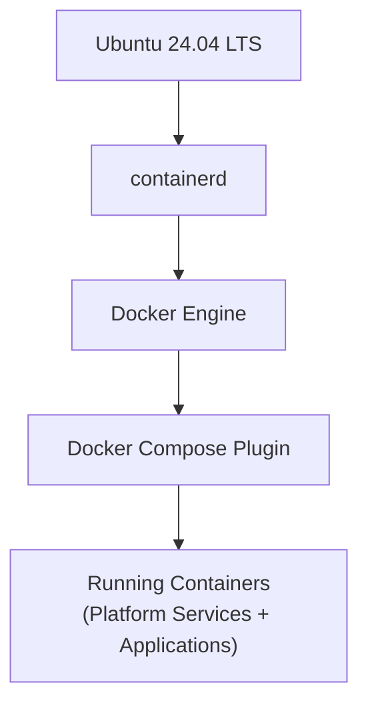
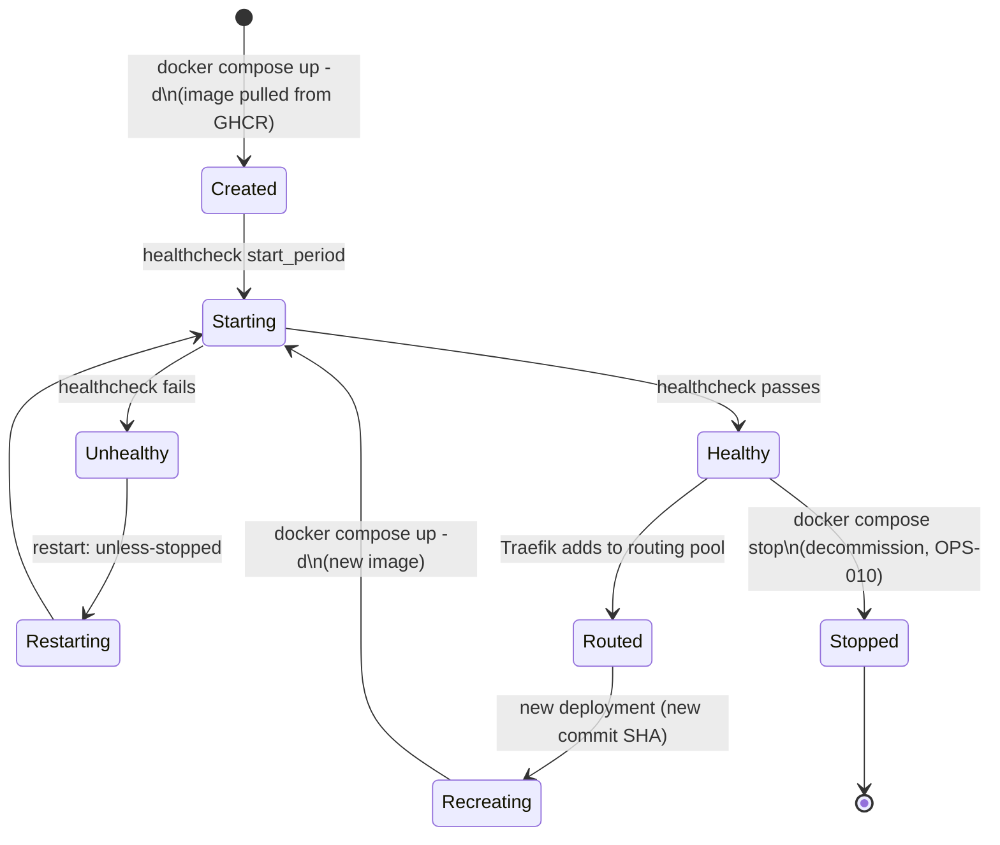

# ARCH-006 — Runtime Architecture

**Status:** Approved

**Version:** 1.0

**Owner:** Platform Team

**Last Updated:** 2026-07-15

---

# 1. Purpose

This document defines the container runtime layer of the platform: what executes containers, how they are configured, and the explicit boundary of what the platform will never run. It expands [ARCH-002, Section 5 — Runtime Layers](ARCH-002-platform-architecture.md#5-runtime-layers) and formalizes [ADR-0001 — Runtime Only](../02-decisions/ADR-0001-runtime-only.md) and [ADR-0007 — Docker Runtime](../02-decisions/ADR-0007-docker-runtime.md).

---

# 2. Scope

Covers the operating system baseline, the container runtime stack, container lifecycle and restart policy, resource constraints, and the explicit exclusion of orchestration platforms. Does not cover network topology (see [ARCH-004](ARCH-004-network-architecture.md)) or backup of runtime state (see [ARCH-008](ARCH-008-backup-architecture.md)).

---

# 3. Runtime Stack

| Layer | Component | Version Policy |
|---|---|---|
| Operating System | Ubuntu 24.04 LTS | LTS only; upgraded per [OPS-006 — Docker Upgrade](../04-operations/OPS-006-docker-upgrade.md) and OS patch cadence in [OPS-010 — Maintenance](../04-operations/OPS-010-maintenance.md) |
| Low-level runtime | containerd | Installed and upgraded as a Docker Engine dependency |
| Container engine | Docker Engine | Latest stable from Docker's official APT repository |
| Orchestration interface | Docker Compose Plugin (`docker compose`) | The only orchestration interface used on the platform |

---

# 4. Explicit Exclusions

Per [ADR-0001 — Runtime Only](../02-decisions/ADR-0001-runtime-only.md), the following are **not** part of the platform runtime and must not be introduced without a new ADR superseding ADR-0001:

- **Kubernetes** — rejected as disproportionate operational overhead for the platform's current scale (see [ARCH-001, Non-Goals](ARCH-001-platform-vision.md)).
- **Docker Swarm** — rejected; Compose alone is sufficient for single-host workload placement.
- **Portainer, or any GUI-based deployment management tool** — rejected; all deployment state is expressed in Git-tracked `compose.yaml` files, not in a stateful management UI, per the Git as Source of Truth principle.

The production server is a Docker runtime host and nothing more. It runs `docker compose pull` and `docker compose up -d`; it never runs `docker build`, `git clone`, or any application build tool.

---

# 5. Container Lifecycle

An application container's lifecycle never includes a "build" state — every transition into `Created`/`Recreating` starts from an image already built and pushed by GitHub Actions ([ARCH-005 — Deployment Strategy](ARCH-005-deployment-strategy.md)). Traefik only routes traffic to a container in the `Healthy` state, so a failing deployment is never silently exposed to traffic.

1. **Creation:** A container is created only by `docker compose up -d` referencing an image already present in GHCR (pulled, not built).
2. **Restart Policy:** Every service in every `compose.yaml` sets `restart: unless-stopped`, per [STD-001 — Compose Standard](../03-standards/STD-001-compose-standard.md), so that a host reboot or container crash is recovered automatically without manual intervention.
3. **Healthcheck:** Every service defines a `healthcheck`. Traefik only routes to containers reporting `healthy` (see [ARCH-005, Section 8](ARCH-005-deployment-strategy.md#8-health-verification)).
4. **Update:** A new deployment does not `docker restart` the existing container — it recreates it against the newly pulled image, per the deployment sequence in [ARCH-005](ARCH-005-deployment-strategy.md).
5. **Removal:** Decommissioning an application removes its containers, its private network, and — only after an explicit, separate confirmation step — its volumes, per [OPS-010 — Maintenance](../04-operations/OPS-010-maintenance.md).

---

# 6. Resource Constraints

Every container declares explicit `deploy.resources.limits` (CPU and memory) in its `compose.yaml`, per [STD-001 — Compose Standard](../03-standards/STD-001-compose-standard.md). Unbounded containers are not permitted, because a single runaway container on a single-host platform can starve every other application — there is no orchestrator to reschedule work elsewhere. Resource usage is continuously observed via Beszel (see [ARCH-009 — Monitoring Architecture](ARCH-009-monitoring-architecture.md)).

---

# 7. User and Filesystem Constraints

- Containers run as a non-root user wherever the base image supports it, per [STD-010 — Security Standard](../03-standards/STD-010-security-standard.md).
- The host's Docker socket (`/var/run/docker.sock`) is mounted read-only, and only into the specific platform services that require it for metrics collection (Beszel); no application container ever mounts the Docker socket.
- Application containers mount only the volume paths they own, under `/srv/apps/<app-name>/volumes` (see [ARCH-002, Section 10](ARCH-002-platform-architecture.md#10-directory-mapping)).

---

# 8. Summary

The platform's runtime is deliberately minimal: one operating system, one container engine, one orchestration interface (Compose), and no cluster manager. Every container is declaratively defined, automatically restarted, resource-bounded, and health-checked. This minimalism is a considered trade-off — it caps the platform's horizontal scaling ceiling in exchange for operational simplicity appropriate to its current scale, revisited only via ADR (see [ROADMAP v2](../05-roadmap/ROADMAP-v2.md)).

---

# 9. References

- [ARCH-002 — Platform Architecture, Section 5](ARCH-002-platform-architecture.md#5-runtime-layers)
- [ADR-0001 — Runtime Only](../02-decisions/ADR-0001-runtime-only.md)
- [ADR-0007 — Docker Runtime](../02-decisions/ADR-0007-docker-runtime.md)
- [STD-001 — Compose Standard](../03-standards/STD-001-compose-standard.md)
- [STD-010 — Security Standard](../03-standards/STD-010-security-standard.md)
