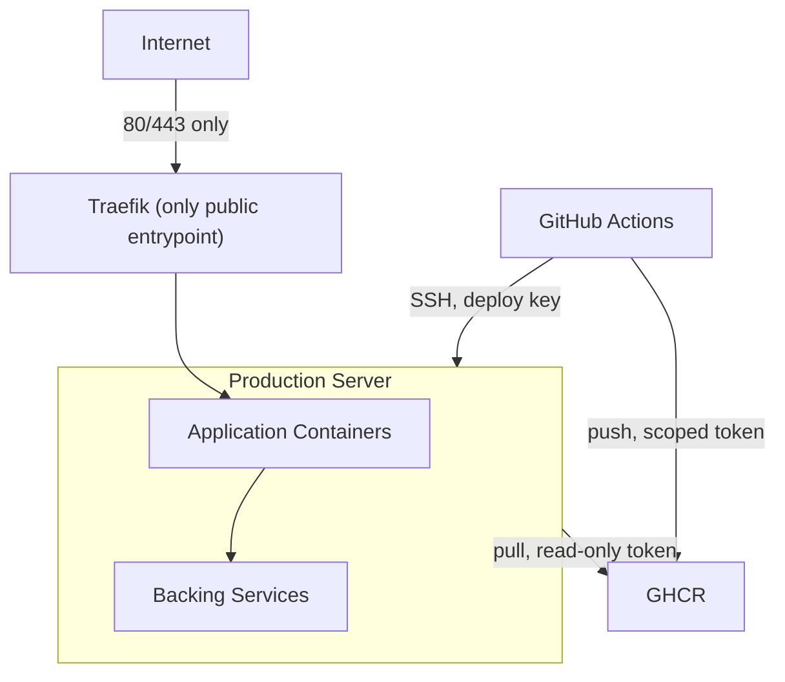

# ARCH-007 — Security Architecture

**Status:** Approved

**Version:** 1.0

**Owner:** Platform Team

**Last Updated:** 2026-07-15

---

# 1. Purpose

This document defines the platform's security architecture: the threat model boundaries, control points, and the specific mechanisms that enforce them. It expands [ARCH-002, Section 11 — Security Boundaries](ARCH-002-platform-architecture.md#11-security-boundaries) into a complete architectural reference.

---

# 2. Scope

Covers access control, secrets handling, network exposure, supply chain integrity, host hardening, and patching. Enforceable, checkable rules derived from this architecture live in [STD-010 — Security Standard](../03-standards/STD-010-security-standard.md).

---

# 3. Threat Model Summary

The platform's primary assets are: the production server's compute and data, the GHCR image registry, and the GitHub repositories (source of truth). The primary threat actors considered are opportunistic internet scanners, credential-stuffing attempts against SSH, and compromised or malicious application dependencies. The platform is explicitly not designed to defend against a compromised GitHub organization owner account or a compromised GitHub Actions supply chain at the platform level beyond the mitigations in Section 7 — those are treated as GitHub-platform-level trust boundaries.

---

# 4. Security Boundaries

## 4.1 Access Control

- SSH key-based authentication only. Password authentication is disabled at the `sshd` level on the production server (see [OPS-001 — Server Provisioning](../04-operations/OPS-001-server-provisioning.md)).
- The GitHub Actions deploy step authenticates using a dedicated deploy key, scoped only to the production server's deploy user, distinct from any personal developer credential.
- The deploy user on the production server has the minimum permissions required to run `docker compose pull` and `docker compose up -d` within `/srv/apps` and `/srv/platform` — not unrestricted root SSH access where avoidable.
- A host firewall (`ufw` or equivalent) permits only ports 22 (SSH, ideally IP-restricted or rate-limited), 80, and 443 inbound.

## 4.2 Secrets

- No password, API key, or credential is ever committed to any Git repository, platform or application.
- Runtime secrets exist in exactly two places: `/srv/apps/<app-name>/.env` on the production server (populated manually or via a documented secret-provisioning step during onboarding) and as encrypted GitHub Actions repository/organization secrets.
- `.env` files are excluded from version control via `.gitignore` in every repository (platform and application), enforced by [STD-005 — Environment Variables](../03-standards/STD-005-environment-variables.md).
- Secrets are never printed to CI logs; workflows use GitHub Actions' built-in secret masking.

## 4.3 Network Exposure

- Only Traefik publishes host ports 80/443, per [ARCH-004 — Network Architecture](ARCH-004-network-architecture.md).
- No application or platform service is reachable from the internet except through Traefik-routed HTTPS.
- Internal Docker networks isolate every application's backing services from every other application and from the internet (Section 6, [ARCH-004](ARCH-004-network-architecture.md)).
- Platform observability tools (Beszel, Uptime Kuma dashboards) are reachable only through Traefik and are protected by authentication; they are never exposed unauthenticated.

## 4.4 Supply Chain

- Production never runs `docker build`. The only images that can run in production are images built by GitHub Actions and pulled from GHCR (see [ADR-0004 — GHCR](../02-decisions/ADR-0004-ghcr.md)).
- Images are addressed exclusively by Git commit SHA, never `latest`, per [ADR-0005](../02-decisions/ADR-0005-git-commit-sha-tags.md), making every running container traceable to an exact, reviewable commit.
- Application base images are pinned to a specific version tag (not a floating major tag) in each application's `Dockerfile`, per [STD-004 — Docker Image Standard](../03-standards/STD-004-docker-image-standard.md).

---

# 5. Host Hardening Baseline

Applied once during provisioning ([OPS-001](../04-operations/OPS-001-server-provisioning.md)) and maintained via [OPS-010 — Maintenance](../04-operations/OPS-010-maintenance.md):

- Automatic OS security updates enabled (`unattended-upgrades` or equivalent).
- `sshd` hardened: password authentication disabled, root login disabled, key-based authentication only.
- Host firewall default-deny inbound, explicit allow for 22/80/443.
- Non-privileged deploy user for CI/CD, not `root`, where the operation permits it.
- Docker daemon configured without exposing the Docker API over TCP.

---

# 6. Container-Level Security

- Containers run as non-root users wherever the base image supports it, per [STD-010](../03-standards/STD-010-security-standard.md).
- The Docker socket is never mounted into application containers; only the metrics platform service (Beszel) mounts it, read-only.
- Each application's backing services (databases, caches) are bound only to that application's private internal network and are never bound to `0.0.0.0` on the host.

---

# 7. Patching and Vulnerability Management

- Host OS packages: automatic security patching, per Section 5.
- Docker Engine: upgraded per [OPS-006 — Docker Upgrade](../04-operations/OPS-006-docker-upgrade.md).
- Application base images: refreshed by each application's own maintenance cadence; the platform recommends, but does not enforce, dependency scanning within each application's own CI pipeline.
- Platform-service images (Traefik, Beszel, Uptime Kuma): version-pinned and upgraded deliberately via a reviewed change, never auto-upgraded by a floating tag.

---

# 8. Summary

Security on this platform is enforced structurally, not by policy alone: there is exactly one public entrypoint, exactly one path for code to reach production (build in CI, pull in prod), no floating image tags, and no direct network path from the internet to a backing service. Every control in this document has a corresponding, checkable rule in [STD-010 — Security Standard](../03-standards/STD-010-security-standard.md).

---

# 9. References

- [ARCH-002 — Platform Architecture, Section 11](ARCH-002-platform-architecture.md#11-security-boundaries)
- [ARCH-004 — Network Architecture](ARCH-004-network-architecture.md)
- [STD-010 — Security Standard](../03-standards/STD-010-security-standard.md)
- [STD-005 — Environment Variables](../03-standards/STD-005-environment-variables.md)
- [OPS-001 — Server Provisioning](../04-operations/OPS-001-server-provisioning.md)
- [OPS-008 — Incident Response](../04-operations/OPS-008-incident-response.md)
