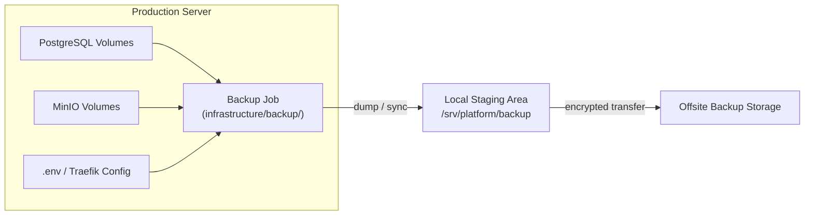

# ARCH-008 — Backup Architecture

**Status:** Approved

**Version:** 1.0

**Owner:** Platform Team

**Last Updated:** 2026-07-15

---

# 1. Purpose

This document defines what the platform backs up, how often, where backups are stored, and how backup integrity is verified. It expands the backup scope table introduced in [ARCH-002, Section 13](ARCH-002-platform-architecture.md#13-disaster-recovery-concept) into a complete architecture, and is the basis for [ADR-0010 — Backup Strategy](../02-decisions/ADR-0010-backup-strategy.md).

---

# 2. Scope

Covers backup scope, schedule, retention, storage destination, and encryption. Restore procedure is documented operationally in [OPS-005 — Restore](../04-operations/OPS-005-restore.md); backup execution procedure is documented in [OPS-004 — Backup](../04-operations/OPS-004-backup.md).

---

# 3. Backup Scope

| Data Class | Example | Backed Up | Method |
|---|---|---|---|
| Application databases | PostgreSQL volumes | Yes | Scheduled logical dump (`pg_dump`) per database |
| Object storage | MinIO data | Yes | Scheduled sync to backup destination |
| Cache | Redis | Only if configured for persistence (AOF/RDB); otherwise treated as rebuildable | Scheduled snapshot sync, when applicable |
| Configuration | `.env` files, Traefik dynamic config | Yes | Scheduled encrypted archive |
| Application source code | N/A | Not applicable | Lives in Git, not on the server |
| Container images | GHCR-hosted images | Not backed up separately | GHCR is the durable store; see [ADR-0004](../02-decisions/ADR-0004-ghcr.md) |

Backup scope follows a single rule: **anything that cannot be regenerated from Git, GHCR, or DNS is backed up; anything that can be is not.**

---

# 4. Backup Flow

Backup jobs run on a schedule (cron, orchestrated by `infrastructure/automation/`), dump or sync live data into a local staging area, then transfer the encrypted result offsite. Local staging is retained only long enough to guarantee a successful offsite transfer, per [STD-008 — Volume Standard](../03-standards/STD-008-volume-standard.md).

---

# 5. Schedule and Retention

| Data Class | Frequency | Retention |
|---|---|---|
| Database dumps | Daily | 14 daily, 8 weekly, 6 monthly (grandfather-father-son rotation) |
| Object storage sync | Daily | Mirrors current state plus 7 days of point-in-time snapshots, where the destination supports it |
| Configuration archive | On every change, plus daily | 30 days |

Retention numbers are enforced by the backup job itself (pruning old backups after a successful new backup), never by manual cleanup.

---

# 6. Storage Destination and Encryption

- Backups are transferred to storage physically or logically separate from the production server (offsite), so that loss of the production server does not also destroy its backups.
- All backup archives are encrypted at rest before or during transfer; the encryption key is never stored alongside the backup itself.
- Access to the offsite backup destination is credentialed separately from production server SSH access, following least privilege.

---

# 7. Verification

A backup that has never been restored is not a verified backup. [OPS-005 — Restore](../04-operations/OPS-005-restore.md) is exercised on a defined cadence (see [OPS-010 — Maintenance](../04-operations/OPS-010-maintenance.md)) against a non-production target to confirm that backup archives are actually restorable, not merely present.

---

# 8. Summary

Backup is scoped tightly to genuinely irreplaceable state — databases, object storage, and configuration — because source code and images are already durably stored in Git and GHCR. Every backup is scheduled, encrypted, rotated, and periodically restore-tested, so that disaster recovery ([ARCH-010](ARCH-010-disaster-recovery-architecture.md)) depends on a verified process rather than an assumed one.

---

# 9. References

- [ARCH-002 — Platform Architecture, Section 13](ARCH-002-platform-architecture.md#13-disaster-recovery-concept)
- [ARCH-010 — Disaster Recovery Architecture](ARCH-010-disaster-recovery-architecture.md)
- [ADR-0010 — Backup Strategy](../02-decisions/ADR-0010-backup-strategy.md)
- [STD-008 — Volume Standard](../03-standards/STD-008-volume-standard.md)
- [OPS-004 — Backup](../04-operations/OPS-004-backup.md)
- [OPS-005 — Restore](../04-operations/OPS-005-restore.md)
