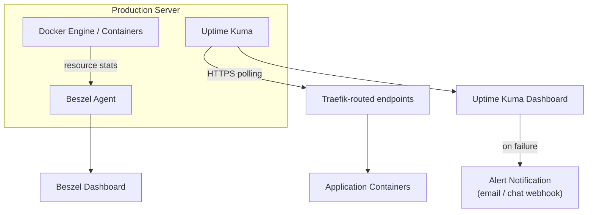

# ARCH-009 — Monitoring Architecture

**Status:** Approved

**Version:** 1.0

**Owner:** Platform Team

**Last Updated:** 2026-07-15

---

# 1. Purpose

This document defines what the platform observes, how it observes it, and how operators are alerted. It formalizes the monitoring components introduced in [ARCH-002, Section 4.5–4.6](ARCH-002-platform-architecture.md#4-platform-components) and is the basis for [ADR-0009 — Monitoring Stack](../02-decisions/ADR-0009-monitoring-stack.md).

---

# 2. Scope

Covers resource metrics, uptime/availability checks, alerting, and log visibility. Does not cover backup verification (see [ARCH-008](ARCH-008-backup-architecture.md)) or incident response procedure (see [OPS-008 — Incident Response](../04-operations/OPS-008-incident-response.md)).

---

# 3. Monitoring Components

| Component | Category | Observes |
|---|---|---|
| Beszel | Resource metrics | Host and per-container CPU, memory, disk, network |
| Uptime Kuma | Availability | HTTP(S) endpoint reachability and response time, for platform services and every application |
| Docker `json-file` logs | Log visibility | Local, per-container stdout/stderr, with rotation (see [ADR-0008 — Logging Strategy](../02-decisions/ADR-0008-logging-strategy.md)) |

The platform deliberately runs no centralized log aggregation or metrics time-series database (e.g., no ELK, no Prometheus/Grafana stack) at the current scale, per the Operational Simplicity principle ([ARCH-001](ARCH-001-platform-vision.md)). This is revisited in [ROADMAP v2](../05-roadmap/ROADMAP-v2.md) if scale demands it.

---

# 4. Monitoring Flow

- **Beszel** runs as a platform service with an agent collecting host and container resource statistics directly (not by polling application endpoints).
- **Uptime Kuma** actively polls every application's public (or internally-routed) HTTPS endpoint on a fixed interval and records uptime/response-time history.
- Both dashboards are reachable only through Traefik and require authentication, per [ARCH-007 — Security Architecture](ARCH-007-security-architecture.md).

---

# 5. What Is Monitored

Every platform service and every business application onboarded to the platform must be registered in Uptime Kuma with at least one HTTP(S) health-check monitor, per [STD-001 — Compose Standard](../03-standards/STD-001-compose-standard.md) (which requires a `healthcheck` in `compose.yaml` that Uptime Kuma's monitor mirrors externally). Beszel monitors the host and every running container automatically; no per-application configuration is required for resource metrics.

---

# 6. Alerting

Uptime Kuma is the source of availability alerting. An endpoint transitioning from up to down triggers a notification via a configured channel (email or chat webhook). Alert routing (who is notified for which application) is configured in Uptime Kuma directly and is reviewed as part of onboarding a new application. Resource-threshold alerting (e.g., disk approaching capacity) is configured in Beszel where supported; otherwise, resource state is checked manually during [OPS-010 — Maintenance](../04-operations/OPS-010-maintenance.md).

---

# 7. Log Visibility

Logs are viewed via `docker compose logs` / `docker logs` directly on the production server, or through a platform service's own log viewer where available. There is no cross-service log search in v1; an operator diagnosing an issue that spans multiple containers correlates logs manually by timestamp. This is an accepted limitation given the platform's current scale (see [ADR-0008 — Logging Strategy](../02-decisions/ADR-0008-logging-strategy.md) for the full rationale).

---

# 8. Summary

Monitoring on the platform is deliberately two-pronged and lightweight: Beszel answers "is the host/container healthy from a resource standpoint," and Uptime Kuma answers "is the service actually reachable and responding." Together they cover the two questions an operator needs answered fastest during an incident, without the operational overhead of a full observability stack.

---

# 9. References

- [ARCH-002 — Platform Architecture, Section 4](ARCH-002-platform-architecture.md#4-platform-components)
- [ADR-0009 — Monitoring Stack](../02-decisions/ADR-0009-monitoring-stack.md)
- [ADR-0008 — Logging Strategy](../02-decisions/ADR-0008-logging-strategy.md)
- [OPS-007 — Monitoring](../04-operations/OPS-007-monitoring.md)
- [OPS-008 — Incident Response](../04-operations/OPS-008-incident-response.md)
