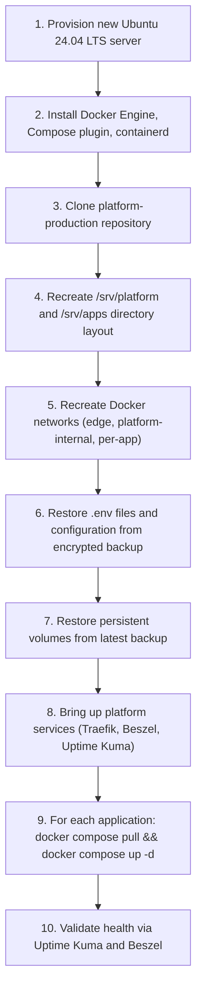

# ARCH-010 — Disaster Recovery Architecture

**Status:** Approved

**Version:** 1.0

**Owner:** Platform Team

**Last Updated:** 2026-07-15

---

# 1. Purpose

This document defines the platform's disaster recovery architecture: recovery objectives, disaster scenarios, and the recovery sequence for each. It expands the disaster recovery concept introduced in [ARCH-002, Section 13](ARCH-002-platform-architecture.md#13-disaster-recovery-concept) into a complete reference. The step-by-step execution of recovery is documented operationally in [OPS-009 — Disaster Recovery](../04-operations/OPS-009-disaster-recovery.md).

---

# 2. Scope

Covers recovery objectives, disaster scenario classification, and the architectural recovery sequence. Does not cover backup mechanics (see [ARCH-008](ARCH-008-backup-architecture.md)) or step-by-step recovery commands (see [OPS-009](../04-operations/OPS-009-disaster-recovery.md)).

---

# 3. Recovery Objectives

| Metric | Target | Rationale |
|---|---|---|
| Recovery Time Objective (RTO) | 4 hours | Bounded by time to provision a new server, restore configuration, and restore the most recent backup — see Section 5 |
| Recovery Point Objective (RPO) | 24 hours | Bounded by daily backup frequency, per [ARCH-008, Section 5](ARCH-008-backup-architecture.md#5-schedule-and-retention) |

These targets apply to a total loss of the production server. Partial failures (a single application crashing) are handled by [OPS-008 — Incident Response](../04-operations/OPS-008-incident-response.md) and typically resolve in minutes, not hours.

---

# 4. Disaster Scenarios

| Scenario | Impact | Recovery Path |
|---|---|---|
| Single application container crash | One application down | Docker `restart: unless-stopped` recovers automatically; escalate via [OPS-008](../04-operations/OPS-008-incident-response.md) if it does not |
| Total production server loss (hardware failure, provider incident) | Entire platform down | Full rebuild per Section 5 and [OPS-009](../04-operations/OPS-009-disaster-recovery.md) |
| Data corruption in a single application's database | One application's data integrity compromised | Restore that application's volume from the latest backup per [OPS-005 — Restore](../04-operations/OPS-005-restore.md), no full-server rebuild needed |
| GHCR unavailable | New deployments blocked; already-running containers unaffected | Wait for GHCR recovery; no platform-side mitigation required, since running containers do not depend on registry availability |
| GitHub unavailable | New deployments blocked; already-running containers unaffected | Same as above |
| Offsite backup destination unavailable at backup time | Backup job fails for that run; local staging retained until next successful run | Alert via [OPS-007 — Monitoring](../04-operations/OPS-007-monitoring.md); investigate before the next scheduled backup window |

The common thread across every scenario: because application source code and images are never stored on the production server, no disaster scenario ever requires recovering source code — only configuration, data, and the runtime itself.

---

# 5. Full Server Recovery Sequence

This sequence is architectural; the executable version with exact commands is [OPS-009 — Disaster Recovery](../04-operations/OPS-009-disaster-recovery.md), which also references [OPS-001 — Server Provisioning](../04-operations/OPS-001-server-provisioning.md) for steps 1–2 and [OPS-005 — Restore](../04-operations/OPS-005-restore.md) for steps 6–7.

Ordering matters: platform services (Traefik, monitoring) come up before applications, because Traefik must exist before any application can be reached, and monitoring must exist before recovery can be validated.

---

# 6. Dependencies for Recovery

Recovery depends on exactly four external assets, none of which live on the production server:

1. **`platform-production` repository (GitHub)** — provides infrastructure configuration and this documentation.
2. **Application repositories (GitHub)** — provide the last known-good commit SHA to redeploy.
3. **GHCR** — provides the actual container images, addressed by commit SHA.
4. **Offsite backup storage** — provides data and configuration state.

Because none of these four assets are hosted on the production server itself, the production server's own failure never puts recovery at risk.

---

# 7. Disaster Recovery Testing

A disaster recovery sequence that has never been executed is unverified. Full recovery drills (standing up a parallel server from backups and validating it) are performed on the cadence defined in [OPS-010 — Maintenance](../04-operations/OPS-010-maintenance.md), not only when an actual disaster occurs.

---

# 8. Summary

Disaster recovery on this platform is structurally simple because the platform's core rules — no source code in production, no builds in production, immutable commit-SHA-tagged images — mean that "rebuild the server" and "redeploy every application" are the same well-tested, automatable operations used for routine onboarding and provisioning, not a separate, rarely-exercised code path.

---

# 9. References

- [ARCH-002 — Platform Architecture, Section 13](ARCH-002-platform-architecture.md#13-disaster-recovery-concept)
- [ARCH-008 — Backup Architecture](ARCH-008-backup-architecture.md)
- [OPS-001 — Server Provisioning](../04-operations/OPS-001-server-provisioning.md)
- [OPS-005 — Restore](../04-operations/OPS-005-restore.md)
- [OPS-009 — Disaster Recovery](../04-operations/OPS-009-disaster-recovery.md)
